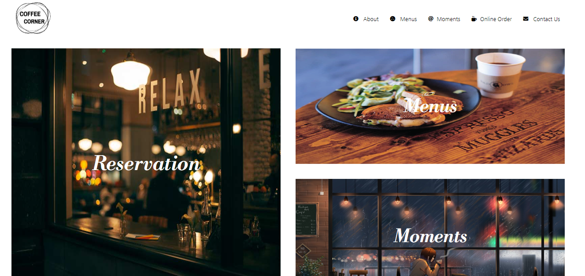
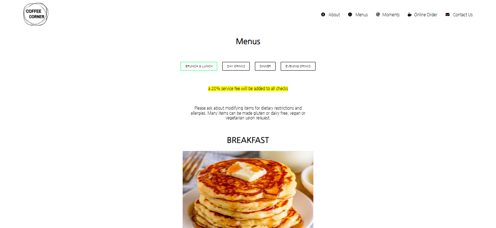

# html-css-project-boilerplate

# **Coffee Corner**

###### Home page

  

**_It's a webpage for a restaurent. User can know different menus we provide,and can order online, can contact us & can make reservations to our live location._**

### **What will we provide?**
​
###### _About US._
​
###### _Menus we provide._
​
###### _Moments of us._
​
###### _Online Order._
​
###### _Reservations._
​
### **Progress**
​
_It's currently at a very early development stage but hoping to get it available to you very soon!_

### **Hosted link**
​
**https://coffee-corner.netlify.app/index.html**
​
### **Web page for a Reataurent**
​
#### Languages used
- _HTML_
- _CSS_

#### Workings
​
- _Home page shows the overview of about us and some of quick links._
- _Header nav bar takes to diffrent options._
- _Contact us button which provides contact informations._
#### Also works fine device with small screen

###### Menu page(java)

  

#### Refernces
- _W3 Schools (https://www.w3schools.com/)_
